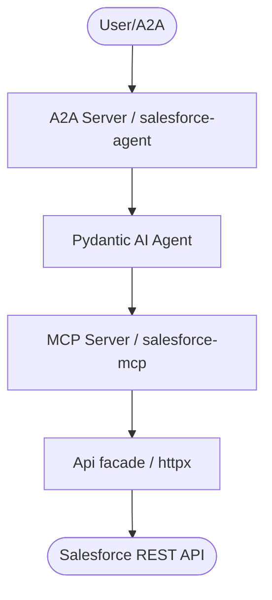

# Salesforce Agent
## CLI or API | MCP | Agent


*Version: 0.5.0*

> **Documentation** — Installation, deployment, usage across the API, CLI, and MCP
> server live on the docs site:
> <https://knuckles-team.github.io/salesforce-agent/>

## Table of Contents

- [Overview](#overview)
- [Architecture](#architecture)
- [Installation](#installation)
- [MCP Tools](#mcp-tools)
- [Auth Flows](#auth-flows)
- [Environment Variables](#environment-variables)
- [Quick Start](#quick-start)
- [Deployment](#deployment)
- [Development](#development)
- [License](#license)

## Overview

**The Salesforce connector for the agent-utilities fleet** — an owned thin
httpx wrapper over the Salesforce REST API exposed as a FastMCP server and an
A2A agent. REST + SOQL/SOSL + Bulk API 2.0 + metadata describe, with safety
gates designed for autonomous agents.

No `simple-salesforce`: every endpoint is a documented thin call with its
Salesforce API doc URL cited in the docstring.

## Architecture



## Installation

```bash
pip install salesforce-agent            # core client only
pip install salesforce-agent[mcp]       # + FastMCP server
pip install salesforce-agent[agent]     # + Pydantic AI A2A agent server
pip install salesforce-agent[jwt]       # + cryptography for the JWT bearer flow
pip install salesforce-agent[all]       # everything
```

Prebuilt Docker image: `knucklessg1/salesforce-agent:latest`.

## MCP Tools

Five consolidated, action-routed tools. Each takes `action` and `params_json`.

| Tool | Actions | Toggle |
|------|---------|--------|
| `salesforce_soql` | `query` (auto-pagination via `nextRecordsUrl`, capped), `query_all` (deleted/archived), `explain`, `search` (SOSL) | `SOQLTOOL` |
| `salesforce_records` | `get` (field selection), `create`, `update`, `upsert` (external id), `delete`*, `composite` (≤25 subrequests), `collections_create`/`collections_update` (≤200 records), `collections_delete`* | `RECORDSTOOL` |
| `salesforce_describe` | `global`, `sobject` (fields/relationships/picklists), `record_counts`, `limits` (API usage) | `DESCRIBETOOL` |
| `salesforce_bulk` | `create_job` (insert/update/upsert/`delete`*/`hardDelete`*), `upload` (CSV), `close`, `abort`, `status`, `list_jobs`, `delete_job`, `results` (successful/failed/unprocessed, size-capped) | `BULKTOOL` |
| `salesforce_admin` | `user_info`, `org_info`, `list_reports`, `run_report` (sync, capped). Listing/running Flows is **out of scope for v1**. | `ADMINTOOL` |

`*` Destructive — blocked unless `SALESFORCE_ALLOW_DESTRUCTIVE=true`.

## Auth Flows

| Flow | Credentials | Notes |
|------|-------------|-------|
| OAuth2 client-credentials | consumer key + secret + My Domain URL | default server-to-server flow |
| OAuth2 refresh-token | refresh token + consumer key | instance URL from token response |
| OAuth2 JWT bearer | consumer key + username + RSA key | `pip install salesforce-agent[jwt]` |
| Static access token | token + instance URL | testing / externally managed sessions |

Sandbox orgs: `SALESFORCE_SANDBOX=true` (`test.salesforce.com`). Tokens are
cached with expiry tracking and refreshed transparently (plus one retry on
401); secrets are redacted from all errors and logs.

## Environment Variables

| Variable | Default | Purpose |
|----------|---------|---------|
| `SALESFORCE_INSTANCE_URL` | — | My Domain instance URL (required for client-credentials and static tokens) |
| `SALESFORCE_LOGIN_URL` | derived | Override the OAuth login host |
| `SALESFORCE_SANDBOX` | `False` | Sandbox org (`test.salesforce.com`) |
| `SALESFORCE_API_VERSION` | `v62.0` | REST API version |
| `SALESFORCE_AUTH_FLOW` | auto | `client_credentials` / `refresh_token` / `jwt_bearer` / `access_token` |
| `SALESFORCE_CLIENT_ID` / `SALESFORCE_CLIENT_SECRET` | — | Connected App consumer key/secret |
| `SALESFORCE_REFRESH_TOKEN` | — | Refresh-token flow credential |
| `SALESFORCE_JWT_SUBJECT` / `SALESFORCE_JWT_PRIVATE_KEY[_PATH]` / `SALESFORCE_JWT_AUDIENCE` | — | JWT bearer flow |
| `SALESFORCE_ACCESS_TOKEN` | — | Static access token (testing) |
| `SALESFORCE_TOKEN_TTL_SECONDS` | `1800` | Cached-token TTL fallback |
| `SALESFORCE_SSL_VERIFY` | `True` | TLS verification |
| `SALESFORCE_TIMEOUT` | `30` | HTTP timeout (seconds) |
| `SALESFORCE_ALLOW_DESTRUCTIVE` | `False` | Gate for all delete paths |
| `SALESFORCE_MAX_QUERY_RECORDS` | `2000` | Per-call SOQL pagination cap |
| `SALESFORCE_BULK_RESULTS_MAX_BYTES` | `5000000` | Bulk result download cap |
| `SALESFORCE_REPORT_MAX_ROWS` | `2000` | Sync report detail-row note (platform cap) |
| `HOST` / `PORT` / `TRANSPORT` | `0.0.0.0` / `8000` / `stdio` | MCP server bind + transport |
| `SOQLTOOL` / `RECORDSTOOL` / `DESCRIBETOOL` / `BULKTOOL` / `ADMINTOOL` | `True` | Per-domain tool toggles |
| `ENABLE_OTEL` / `OTEL_EXPORTER_OTLP_*` | — | Telemetry (OTEL / Langfuse) |
| `EUNOMIA_TYPE` / `EUNOMIA_POLICY_FILE` / `EUNOMIA_REMOTE_URL` | `none` | MCP authorization middleware |
| `AUTH_TYPE` | `none` | MCP server auth mode (Docker) |

See `.env.example` for the full annotated list.

## Quick Start

```bash
pip install salesforce-agent[all]
cp .env.example .env   # fill in one auth flow
salesforce-mcp         # stdio MCP server
```

```python
from salesforce_agent import Api

api = Api()  # configured from SALESFORCE_* env vars
rows = api.soql.query("SELECT Id, Name FROM Account", max_records=200)
api.records.upsert("Account", "External_Id__c", "X-1", {"Name": "Acme"})
```

Typed tool-input contracts live in
`salesforce_agent.salesforce_input_models`; typed error envelopes in
`salesforce_agent.salesforce_response_models`.

## Deployment

```bash
# MCP server only (port 8000, streamable-http, /health)
docker compose -f docker/mcp.compose.yml up -d

# MCP server + A2A agent server (agent on port 9020, AG-UI web interface)
docker compose -f docker/agent.compose.yml up -d
```

The A2A agent server (`salesforce-agent` console script, `agent_server.py`)
reads `MCP_URL`, `PROVIDER`, and `MODEL_ID` from the environment. See
[docs/deployment.md](docs/deployment.md) for transports, reverse proxy, and
DNS guidance.

See [docs/](docs/index.md) for the full overview, installation, usage, and
deployment guides; concept registry in [docs/concepts.md](docs/concepts.md)
(`CONCEPT:SFDC-1.x`).

<!-- BEGIN GENERATED: additional-deployment-options -->
### Additional Deployment Options

`salesforce-agent` can also run as a **local container** (Docker / Podman / `uv`) or be
consumed from a **remote deployment**. The
[Deployment guide](https://knuckles-team.github.io/salesforce-agent/deployment/) has full, copy-paste
`mcp_config.json` for all four transports — **stdio**, **streamable-http**,
**local container / uv**, and **remote URL**:

- **Local container / uv** — launch the server from `mcp_config.json` via `uvx`,
  `docker run`, or `podman run`, or point at a local streamable-http container by `url`.
- **Remote URL** — connect to a server deployed behind Caddy at
  `http://salesforce-mcp.arpa/mcp` using the `"url"` key.
<!-- END GENERATED: additional-deployment-options -->

## Development

```bash
pip install -e .[all,test]
pytest                       # mocked httpx suite — no live org required
pre-commit run --all-files   # must be fully green before committing
```

## License

MIT — see [LICENSE](LICENSE).


<!-- BEGIN agent-os-genesis-deploy (generated; do not edit between markers) -->

## Deploy with `agent-os-genesis`

This package can be provisioned for you — skill-guided — by the **`agent-os-genesis`**
universal skill (its *single-package deploy mode*): it picks your install method, seeds
secrets to OpenBao/Vault (or `.env`), trusts your enterprise CA, registers the MCP
server, and verifies it — the same machinery that stands up the whole Agent OS, narrowed
to just this package. Ask your agent to **"deploy `salesforce-agent` with agent-os-genesis"**.

| Install mode | Command |
|------|---------|
| Bare-metal, prod (PyPI) | `uvx salesforce-mcp` · or `uv tool install salesforce-agent` |
| Bare-metal, dev (editable) | `uv pip install -e ".[all]"` · or `pip install -e ".[all]"` |
| Container, prod | deploy `knucklessg1/salesforce-agent:latest` via docker-compose / swarm / podman / podman-compose / kubernetes |
| Container, dev (editable) | deploy `docker/compose.dev.yml` (source-mounted at `/src`; edits live on restart) |

Secrets are read-existing + seeded via `vault_sync` — you are only prompted for what's missing.

<!-- END agent-os-genesis-deploy -->
