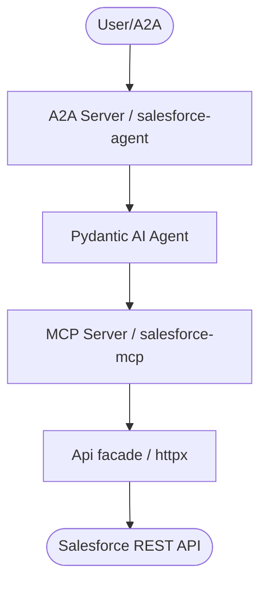

# Salesforce Agent
## CLI or API | MCP | Agent


*Version: 2.1.0*

> **Documentation** — Installation, deployment, usage across the API, CLI, and MCP
> server live on the docs site:
> <https://knuckles-team.github.io/salesforce-agent/>

## Table of Contents

- [Overview](#overview)
- [Architecture](#architecture)
- [Installation](#installation)
- [MCP Tools](#mcp-tools)
- [Auth Flows](#auth-flows)
- [Environment Variables](#environment-variables)
- [Quick Start](#quick-start)
- [Deployment](#deployment)
- [Development](#development)
- [License](#license)

## Overview

**The Salesforce connector for the agent-utilities fleet** — an owned thin
httpx wrapper over the Salesforce REST API exposed as a FastMCP server and an
A2A agent. REST + SOQL/SOSL + Bulk API 2.0 + metadata describe, with safety
gates designed for autonomous agents.

No `simple-salesforce`: every endpoint is a documented thin call with its
Salesforce API doc URL cited in the docstring.

## Architecture


```mermaid
graph TD
    User([User/A2A]) --> Server[A2A Server / salesforce-agent]
    Server --> Agent[Pydantic AI Agent]
    Agent --> MCP[MCP Server / salesforce-mcp]
    MCP --> Client[Api facade / httpx]
    Client --> ExternalAPI([Salesforce REST API])
```

## Installation

> **Install the connector-focused `[mcp]` extra.** Examples use `salesforce-agent[mcp]` to add
> FastMCP / FastAPI through `agent-utilities[mcp]`; the required Agent Utilities core
> still carries `epistemic-graph[full]`. The `[agent]` extra additionally
> enables model orchestration.

Pick the extra that matches what you want to run:

| Extra | Installs | Use when |
|-------|----------|----------|
| `salesforce-agent` (core) | Owned thin httpx Salesforce client (no server tooling) | You only use the **Python `Api` client** |
| `salesforce-agent[mcp]` | Connector-focused MCP server (`agent-utilities[mcp]` — FastMCP/FastAPI + `epistemic-graph[full]`) | You run the **MCP server** (smallest server install / image) |
| `salesforce-agent[agent]` | Agent runtime (`agent-utilities[agent-runtime,logfire]` — model orchestration + `epistemic-graph[full]`) | You run the **integrated agent** |
| `salesforce-agent[jwt]` | + `cryptography` for the JWT bearer flow | You authenticate via OAuth2 JWT bearer |
| `salesforce-agent[all]` | Everything (`mcp` + `agent` + `jwt` + `logfire`) | Development / all surfaces |

```bash
pip install salesforce-agent            # core client only
pip install "salesforce-agent[mcp]"     # + FastMCP server
pip install "salesforce-agent[agent]"   # + Pydantic AI A2A agent (epistemic-graph engine)
pip install "salesforce-agent[jwt]"     # + cryptography for the JWT bearer flow
pip install "salesforce-agent[all]"     # everything
```

### Container images (`:mcp` vs `:agent`)

One multi-stage `docker/Dockerfile` builds two right-sized images, selected by `--target`:

| Image tag | Build target | Contents | Entrypoint |
|-----------|--------------|----------|------------|
| `example/salesforce-agent:mcp` | `--target mcp` | `salesforce-agent[mcp]` — **connector-focused**, includes `epistemic-graph[full]`; no model-orchestration stack | `salesforce-mcp` |
| `example/salesforce-agent@sha256:<digest>` | `--target agent` (default) | `salesforce-agent[agent]` — **agent runtime**, model orchestration + `epistemic-graph[full]` | `salesforce-agent` |

```bash
docker build --target mcp   -t example/salesforce-agent:mcp    docker/   # connector-focused MCP server
docker build --target agent -t example/salesforce-agent:agent-local docker/   # agent runtime
```

`docker/mcp.compose.yml` runs the connector-focused `:mcp` server; `docker/agent.compose.yml` runs the
agent (`immutable agent digest`) with a co-located `:mcp` sidecar.

### Knowledge-graph database (`epistemic-graph`)

Both `[mcp]` and `[agent]` carry the **epistemic-graph** engine through the required
Agent Utilities core dependency (`epistemic-graph[full]`). The `[mcp]` extra keeps
the server connector-focused; `[agent]` additionally enables model orchestration. Local
deployments can use the bundled engine. For production or shared state, run
**epistemic-graph as a dedicated database service** and configure the runtime to use it.
Deployment recipes (single-node + Raft HA), connection configuration, and architecture
diagrams are documented in the
[epistemic-graph deployment guide](https://knuckles-team.github.io/epistemic-graph/deployment/).

## MCP Tools

Consolidated, action-routed tools. Each takes `action` and `params_json`. The table below is auto-generated from the MCP server — do not edit by hand.

<!-- MCP-TOOLS-TABLE:START -->

#### Condensed action-routed tools (default — `MCP_TOOL_MODE=condensed`)

| MCP Tool | Toggle Env Var | Description |
|----------|----------------|-------------|
| `salesforce_admin` | `ADMINTOOL` | Inspect the current user/org and run analytics reports. |
| `salesforce_bulk` | `BULKTOOL` | Drive Bulk API 2.0 ingest jobs: create, upload, close, results. |
| `salesforce_describe` | `DESCRIBETOOL` | Discover org schema, record counts, and limits/API usage. |
| `salesforce_records` | `RECORDSTOOL` | CRUD on sObject records, composite batches, and collections. |
| `salesforce_soql` | `SOQLTOOL` | Run SOQL queries (paginated, capped) and SOSL searches. |

#### Verbose 1:1 API-mapped tools (`MCP_TOOL_MODE=verbose` or `both`)

<details>
<summary>1 per-operation tools — one per public API method (click to expand)</summary>

| MCP Tool | Toggle Env Var | Description |
|----------|----------------|-------------|
| `salesforce_close` | `APITOOL` | Invoke the close operation. |

</details>

_5 action-routed tool(s) (default) · 1 verbose 1:1 tool(s). Each is enabled unless its `<DOMAIN>TOOL` toggle is set false; `MCP_TOOL_MODE` selects the surface (`condensed` default · `verbose` 1:1 · `both`). Auto-generated — do not edit._
<!-- MCP-TOOLS-TABLE:END -->

`*` Destructive — blocked unless `SALESFORCE_ALLOW_DESTRUCTIVE=true`.

## Auth Flows

| Flow | Credentials | Notes |
|------|-------------|-------|
| OAuth2 client-credentials | consumer key + secret + My Domain URL | default server-to-server flow |
| OAuth2 refresh-token | refresh token + consumer key | instance URL from token response |
| OAuth2 JWT bearer | consumer key + username + RSA key | `pip install salesforce-agent[jwt]` |
| Static access token | token + instance URL | testing / externally managed sessions |

Sandbox orgs: `SALESFORCE_SANDBOX=true` (`test.salesforce.com`). Tokens are
cached with expiry tracking and refreshed transparently (plus one retry on
401); secrets are redacted from all errors and logs.

## Environment Variables

<!-- ENV-VARS-TABLE:START -->

#### Package environment variables

| Variable | Example | Description |
|----------|---------|-------------|
| `HOST` | `0.0.0.0` |  |
| `PORT` | `8000` |  |
| `TRANSPORT` | `stdio` | options: stdio, streamable-http, sse |
| `ENABLE_OTEL` | `True` |  |
| `OTEL_EXPORTER_OTLP_ENDPOINT` | `http://localhost:8080/api/public/otel` |  |
| `OTEL_EXPORTER_OTLP_PUBLIC_KEY` | secret-injected |  |
| `OTEL_EXPORTER_OTLP_SECRET_KEY` | secret-injected |  |
| `OTEL_EXPORTER_OTLP_PROTOCOL` | `http/protobuf` |  |
| `EUNOMIA_TYPE` | `none` | options: none, embedded, remote |
| `EUNOMIA_POLICY_FILE` | `mcp_policies.json` |  |
| `EUNOMIA_REMOTE_URL` | `http://eunomia-server:8000` |  |
| `SALESFORCE_INSTANCE_URL` | `https://yourorg.my.salesforce.com` | My Domain instance URL (required for client_credentials and static tokens) |
| `SALESFORCE_LOGIN_URL` | — | Override the OAuth login host (otherwise derived from SALESFORCE_SANDBOX) |
| `SALESFORCE_SANDBOX` | `False` | Sandbox org? true -> https://test.salesforce.com |
| `SALESFORCE_API_VERSION` | `v62.0` | REST API version |
| `SALESFORCE_TLS_PROFILE` | `system` | Named outbound TLS policy from AgentConfig. A reference can provide runtime-only trust material without storing machine-specific paths. |
| `SALESFORCE_TLS_PROFILE_REF` | — |  |
| `SALESFORCE_TIMEOUT` | `30` | HTTP timeout in seconds |
| `SALESFORCE_AUTH_FLOW` | — | Explicit override: client_credentials \| refresh_token \| jwt_bearer \| access_token |
| `SALESFORCE_CLIENT_ID` | — | Connected App consumer key/secret (client_credentials, refresh_token, jwt_bearer) |
| `SALESFORCE_CLIENT_SECRET` | secret-injected |  |
| `SALESFORCE_REFRESH_TOKEN` | secret-injected | Refresh-token flow |
| `SALESFORCE_JWT_SUBJECT` | `integration.user@yourorg.com` | JWT bearer flow (pip install salesforce-agent[jwt]) |
| `SALESFORCE_JWT_PRIVATE_KEY` | secret-injected |  |
| `SALESFORCE_JWT_PRIVATE_KEY_PATH` | secret-injected |  |
| `SALESFORCE_JWT_AUDIENCE` | — |  |
| `SALESFORCE_ACCESS_TOKEN` | secret-injected | Static access token (testing / short-lived sessions) |
| `SALESFORCE_TOKEN_TTL_SECONDS` | secret-injected | Cached-token TTL when the token response has no expires_in |
| `SALESFORCE_ALLOW_DESTRUCTIVE` | `False` | Gate for record delete, collections delete, and bulk delete/hardDelete jobs |
| `SALESFORCE_MAX_QUERY_RECORDS` | `2000` | Per-call cap on auto-paginated SOQL results |
| `SALESFORCE_BULK_RESULTS_MAX_BYTES` | `5000000` | Per-call cap on Bulk API 2.0 result downloads (bytes) |
| `SALESFORCE_REPORT_MAX_ROWS` | `2000` | Synchronous report row note (Salesforce platform caps at 2000 detail rows) |
| `SALESFORCETOOL` | `True` | Master toggle for the whole Salesforce tool surface |
| `SOQLTOOL` | `True` |  |
| `RECORDSTOOL` | `True` |  |
| `DESCRIBETOOL` | `True` |  |
| `BULKTOOL` | `True` |  |
| `ADMINTOOL` | `True` |  |

#### Inherited agent-utilities variables (apply to every connector)

| Variable | Example | Description |
|----------|---------|-------------|
| `MCP_TOOL_MODE` | `intent` | Tool surface: `intent` \| `condensed` \| `verbose` \| `both` |
| `MCP_ENABLED_TOOLS` | — | Comma-separated tool allow-list |
| `MCP_DISABLED_TOOLS` | — | Comma-separated tool deny-list |
| `MCP_ENABLED_TAGS` | — | Comma-separated tag allow-list |
| `MCP_DISABLED_TAGS` | — | Comma-separated tag deny-list |
| `MCP_CLIENT_AUTH` | — | Outbound MCP child auth: `oidc-client-credentials` \| `basic` \| `none` |
| `OIDC_CLIENT_ID` | — | OIDC client id (service-account auth) |
| `OIDC_CLIENT_SECRET_REF` | `secret://identity/oidc-client-secret` | Runtime secret reference for the OIDC service account |
| `MCP_BASIC_AUTH_USERNAME` | — | HTTP Basic username (`MCP_CLIENT_AUTH=basic`) |
| `MCP_BASIC_AUTH_PASSWORD_REF` | `secret://identity/mcp-basic-password` | Runtime secret reference for HTTP Basic auth (`MCP_CLIENT_AUTH=basic`) |
| `DEBUG` | `False` | Verbose logging |
| `PYTHONUNBUFFERED` | `1` | Unbuffered stdout (recommended in containers) |
| `MCP_URL` | `http://localhost:8000/mcp` | URL of the MCP server the agent connects to |
| `PROVIDER` | `openai` | LLM provider for the agent |
| `MODEL_ID` | `gpt-4o` | Model id for the agent |
| `ENABLE_WEB_UI` | `True` | Serve the AG-UI web interface |

_38 package + 16 inherited variable(s). Auto-generated from `.env.example` + the shared agent-utilities set — do not edit._
<!-- ENV-VARS-TABLE:END -->


| Variable | Default | Purpose |
|----------|---------|---------|
| `SALESFORCE_INSTANCE_URL` | — | My Domain instance URL (required for client-credentials and static tokens) |
| `SALESFORCE_LOGIN_URL` | derived | Override the OAuth login host |
| `SALESFORCE_SANDBOX` | `False` | Sandbox org (`test.salesforce.com`) |
| `SALESFORCE_API_VERSION` | `v62.0` | REST API version |
| `SALESFORCE_AUTH_FLOW` | auto | `client_credentials` / `refresh_token` / `jwt_bearer` / `access_token` |
| `SALESFORCE_CLIENT_ID` / `SALESFORCE_CLIENT_SECRET` | — | Connected App consumer key/secret |
| `SALESFORCE_REFRESH_TOKEN` | — | Refresh-token flow credential |
| `SALESFORCE_JWT_SUBJECT` / `SALESFORCE_JWT_PRIVATE_KEY[_PATH]` / `SALESFORCE_JWT_AUDIENCE` | — | JWT bearer flow |
| `SALESFORCE_ACCESS_TOKEN` | — | Static access token (testing) |
| `SALESFORCE_TOKEN_TTL_SECONDS` | `1800` | Cached-token TTL fallback |
| `SALESFORCE_TLS_PROFILE` | `system` | TLS verification |
| `SALESFORCE_TIMEOUT` | `30` | HTTP timeout (seconds) |
| `SALESFORCE_ALLOW_DESTRUCTIVE` | `False` | Gate for all delete paths |
| `SALESFORCE_MAX_QUERY_RECORDS` | `2000` | Per-call SOQL pagination cap |
| `SALESFORCE_BULK_RESULTS_MAX_BYTES` | `5000000` | Bulk result download cap |
| `SALESFORCE_REPORT_MAX_ROWS` | `2000` | Sync report detail-row note (platform cap) |
| `HOST` / `PORT` / `TRANSPORT` | `0.0.0.0` / `8000` / `stdio` | MCP server bind + transport |
| `SOQLTOOL` / `RECORDSTOOL` / `DESCRIBETOOL` / `BULKTOOL` / `ADMINTOOL` | `True` | Per-domain tool toggles |
| `ENABLE_OTEL` / `OTEL_EXPORTER_OTLP_*` | — | Telemetry (OTEL / Langfuse) |
| `EUNOMIA_TYPE` / `EUNOMIA_POLICY_FILE` / `EUNOMIA_REMOTE_URL` | `none` | MCP authorization middleware |
| `AUTH_TYPE` | `none` | MCP server auth mode (Docker) |

See `.env.example` for the full annotated list.

## Quick Start

```bash
pip install salesforce-agent[all]
cp .env.example .env   # fill in one auth flow
salesforce-mcp         # stdio MCP server
```

```python
from salesforce_agent import Api

api = Api()  # configured from SALESFORCE_* env vars
rows = api.soql.query("SELECT Id, Name FROM Account", max_records=200)
api.records.upsert("Account", "External_Id__c", "X-1", {"Name": "Acme"})
```

Typed tool-input contracts live in
`salesforce_agent.salesforce_input_models`; typed error envelopes in
`salesforce_agent.salesforce_response_models`.

## Deployment

```bash
# MCP server only (port 8000, streamable-http, /health)
docker compose -f docker/mcp.compose.yml up -d

# MCP server + A2A agent server (agent on port 9020, AG-UI web interface)
docker compose -f docker/agent.compose.yml up -d
```

The A2A agent server (`salesforce-agent` console script, `agent_server.py`)
reads `MCP_URL`, `PROVIDER`, and `MODEL_ID` from the environment. See
[docs/deployment.md](docs/deployment.md) for transports, reverse proxy, and
DNS guidance.

See [docs/](docs/index.md) for the full overview, installation, usage, and
deployment guides; concept registry in [docs/concepts.md](docs/concepts.md)
(`CONCEPT:SF-OS.config.sfdc-x`).

<!-- BEGIN GENERATED: additional-deployment-options -->
### Additional Deployment Options

`salesforce-agent` can run as a local stdio process or container, or behind a remote
network boundary. The
[Deployment guide](https://knuckles-team.github.io/salesforce-agent/deployment/) carries
the detailed transport contract.

- **Local container** — launch a reviewed immutable image as a least-privilege
  stdio child with no listener or published port.
- **Remote URL** — connect through an operator-supplied authenticated HTTPS
  ingress. Keep its URL, outbound identity references, trust profile, and exact
  `MCP_ALLOWED_HOSTS` in `AgentConfig`.
<!-- END GENERATED: additional-deployment-options -->

## Development

```bash
pip install -e .[all,test]
pytest                       # mocked httpx suite — no live org required
pre-commit run --all-files   # must be fully green before committing
```

## License

MIT — see [LICENSE](LICENSE).


<!-- BEGIN agent-utilities-deployment (generated; do not edit between markers) -->

## Deploy with `agent-utilities-deployment`

Provision this package with the consolidated **`agent-utilities-deployment`**
workflow. It selects an installed-package, editable-source, or immutable-container
path; records only runtime secret and TLS-profile references in `AgentConfig`; and
runs doctor, registration, policy, observability, and rollback gates. Ask your agent
to **"deploy `salesforce-agent` with agent-utilities-deployment"**.

| Install mode | Command |
|------|---------|
| Installed package | `uv tool install "salesforce-agent[mcp]"`, then run `salesforce-mcp` |
| Editable source | `uv pip install -e ".[agent]"`, then run `salesforce-mcp` |
| Immutable container | deploy `registry.example.invalid/salesforce-agent@sha256:<digest>` through the operator-selected orchestrator |

The repository embeds no deployment profile, credential value, certificate path, or
environment-specific endpoint. Supply those at runtime through `AgentConfig` and the
configured secret provider.

<!-- END agent-utilities-deployment -->

<!-- GOVERNED-CAPABILITY:START -->
## Governed capability contract

This package ships a compact canonical skill surface with specialist procedures
kept as referenced workflows. The current MCP tools, skill metadata,
`connector_manifest.yml`, ontology, mappings, shapes, fixtures, migrations,
tool-schema fingerprints, and certification metadata form one versioned
capability contract. Validate them together; do not rely on stale tool names or
historical per-task skill wrappers.

Runtime endpoints, credentials, certificate trust, tenant identity, retention,
and observability policy are deployment inputs and are never packaged values.
See [Configuration, trust, and privacy](docs/configuration.md) before enabling a
network transport, connector ingestion, GraphOS delegation, or trace export.
<!-- GOVERNED-CAPABILITY:END -->
