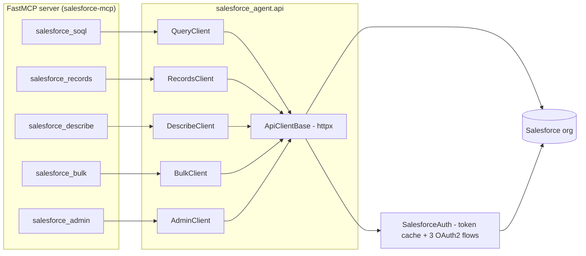

# Overview

## Architecture

## Tool surface (action-routed)

| Tool | Actions |
|------|---------|
| `salesforce_soql` | `query` (auto-paginated, capped), `query_all` (soft-deleted/archived), `explain`, `search` (SOSL) |
| `salesforce_records` | `get`, `create`, `update`, `upsert`, `delete`*, `composite` (≤25 subrequests), `collections_create`/`collections_update` (≤200), `collections_delete`* |
| `salesforce_describe` | `global`, `sobject` (fields/relationships/picklists), `record_counts`, `limits` |
| `salesforce_bulk` | `create_job` (insert/update/upsert/`delete`*/`hardDelete`*), `upload` (CSV), `close`, `abort`, `status`, `list_jobs`, `delete_job`, `results` (size-capped) |
| `salesforce_admin` | `user_info`, `org_info`, `list_reports`, `run_report` (sync, platform-capped at 2000 rows). Flows are **out of scope for v1**. |

`*` gated by `SALESFORCE_ALLOW_DESTRUCTIVE` (default `False`).

## Auth-flow matrix

| Flow | Required settings | Token endpoint | Notes |
|------|-------------------|----------------|-------|
| `client_credentials` | `SALESFORCE_CLIENT_ID`, `SALESFORCE_CLIENT_SECRET`, `SALESFORCE_INSTANCE_URL` | My Domain `/services/oauth2/token` | Salesforce requires the My Domain host for this flow |
| `refresh_token` | `SALESFORCE_REFRESH_TOKEN`, `SALESFORCE_CLIENT_ID` (+ secret if the app requires it) | login URL or My Domain | instance URL taken from the token response |
| `jwt_bearer` | `SALESFORCE_CLIENT_ID`, `SALESFORCE_JWT_SUBJECT`, `SALESFORCE_JWT_PRIVATE_KEY[_PATH]` | login URL (`aud` claim) | needs the `jwt` extra (`cryptography`) |
| `access_token` | `SALESFORCE_ACCESS_TOKEN`, `SALESFORCE_INSTANCE_URL` | none | static; no refresh-on-401 |

The flow is auto-detected from the credentials present, or pinned with
`SALESFORCE_AUTH_FLOW`. `SALESFORCE_SANDBOX=true` switches the default login
host to `https://test.salesforce.com`. Tokens are cached with expiry
(`expires_in` when returned, else `SALESFORCE_TOKEN_TTL_SECONDS`) and the
HTTP layer retries exactly once on 401 after invalidating the cache.
